# Цель:
## понять как устанавливать рокет линукс и как им пользоваться

## Шаг / Фото №4
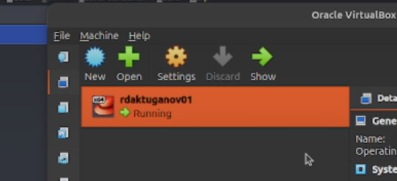

*Рис. 4 — *

**Наблюдение:**  мы создали вм
---
## Шаг / Фото №5

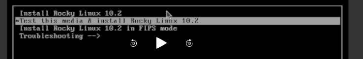

*Рис. 5 — *

**Наблюдение:**   установка роки линукса
---
## Шаг / Фото №6

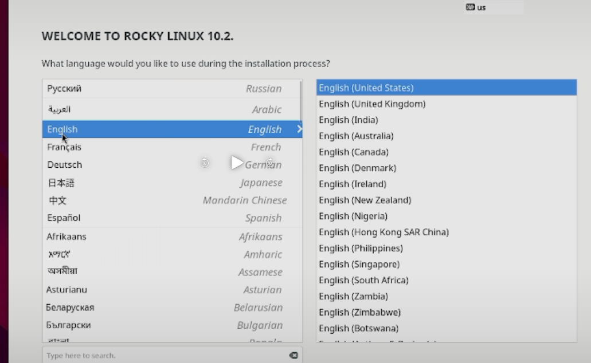

*Рис. 6 — *

**Наблюдение:**  выбор языка
---
## Шаг / Фото №7

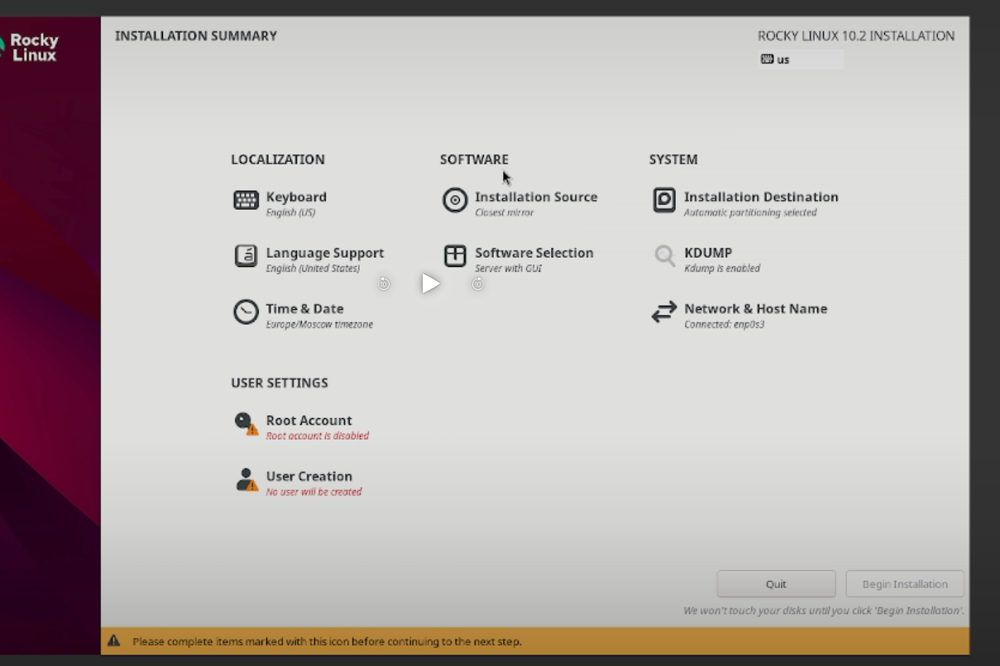

*Рис. 7 — *

**Наблюдение:**   мы настроили все для инициализации
---
## Шаг / Фото №8

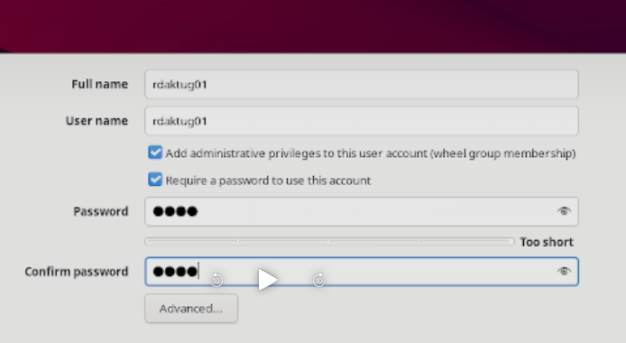

*Рис. 8 — *

**Наблюдение:**  ставим пороль и логин
---
## Шаг / Фото №9

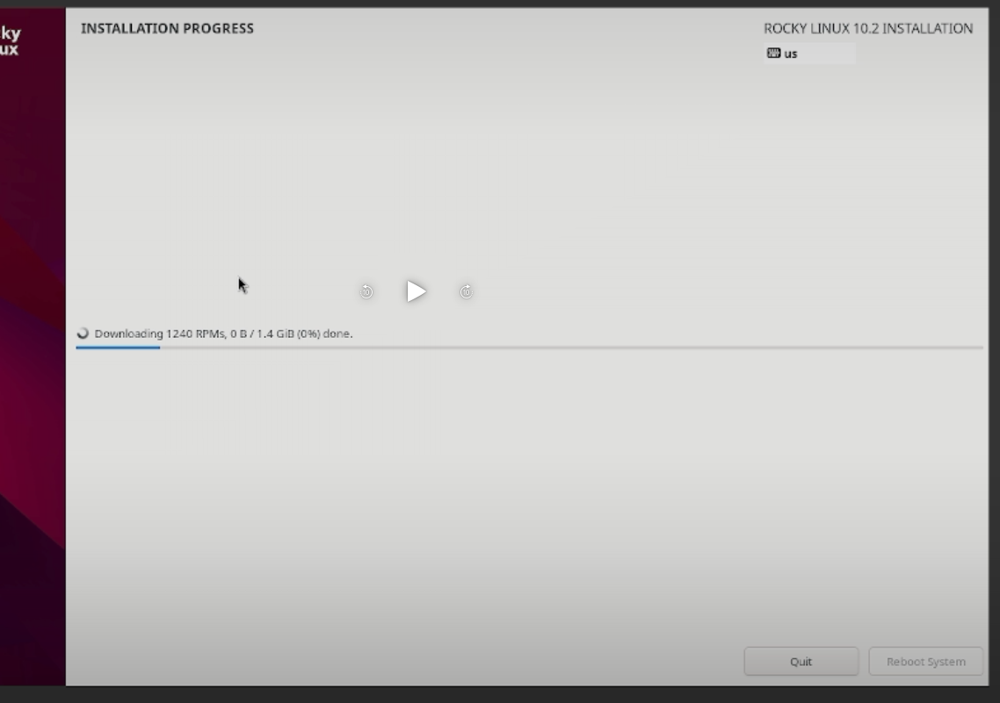

*Рис. 9 — *

**Наблюдение:**  скачиваем что осталось так как не дмд исо была
---
## Шаг / Фото №10

*Рис. 10 — *

**Наблюдение:** используем dmesg | less 
---
## Шаг / Фото №11

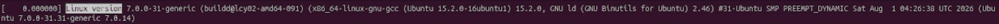

*Рис. 11 — *

**Наблюдение:**  смотри версию линукса
---
## Шаг / Фото №12

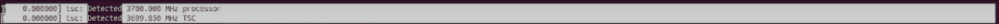

*Рис. 12 — *

**Наблюдение:**  частота процессора
---
## Шаг / Фото №13

*Рис. 13 — *

**Наблюдение:**  Модель процессора
---
## Шаг / Фото №14

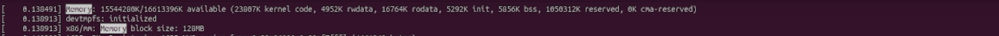

*Рис. 14 — *

**Наблюдение:**  Объем доступной оперативной памяти
---
## Шаг / Фото №15

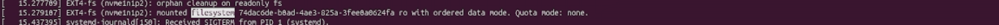

*Рис. 15 — *

**Наблюдение:**  Тип обнаруженного гипервизора
---
## Шаг / Фото №16

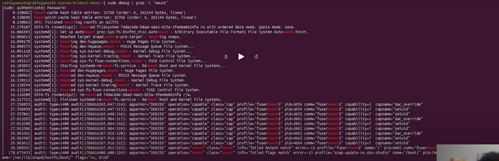

*Рис. 16 — *

**Наблюдение:**  Последовательность монтирования файловых систем
---
## Шаг / Фото №17

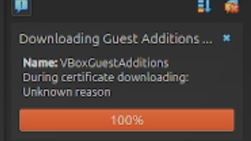

*Рис. 17 — *

**Наблюдение:**  скачивание ыиртуального диска в вбокс
---
## Шаг / Фото №18

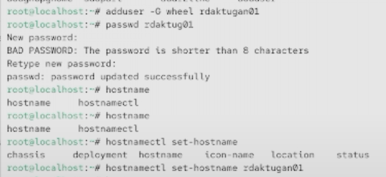

*Рис. 18 — *

**Наблюдение:**   создание нового юзера  и указывание его как хоста
---
**Вывод:**  мы научились создовать виртувльную машину и смотренть характеристики на линукс

# контрольные вопросы

### 1. Укажите команды терминала и приведите примеры:
– для получения справки по команде;

man

– для перемещения по файловой системе;

cd

– для просмотра содержимого каталога;

ls

– для определения объёма каталога;

ls -la

– для создания / удаления каталогов / файлов;

mkdir rmdir touch rm

– для задания определённых прав на файл / каталог;

chmod

– для просмотра истории команд.

history

### 2. Какую информацию содержит учётная запись пользователя? Какие команды позволяют посмотреть информацию о пользователе?

dmesg | less
### 3. Что такое файловая система? Приведите примеры с краткой характеристикой.

система при помоши которой кодируются файлы

ext4 - в основном на линуксах

FAT32 - старая и универсальная файловая система, но максимальный размер одного файла ограничений 4 ГБ.

### 4. Как посмотреть, какие файловые системы подмонтированы в ОС?
mount
df -Th
lsblk -f

### 5. Как удалить зависший процесс?
ps aux | grep имя_процесса   
kill PID                      
kill -9 PID                   
killall имя_процесса